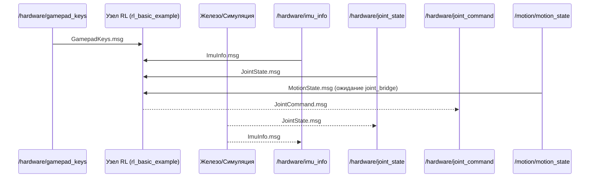
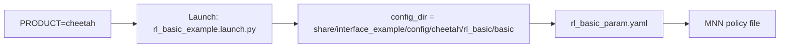
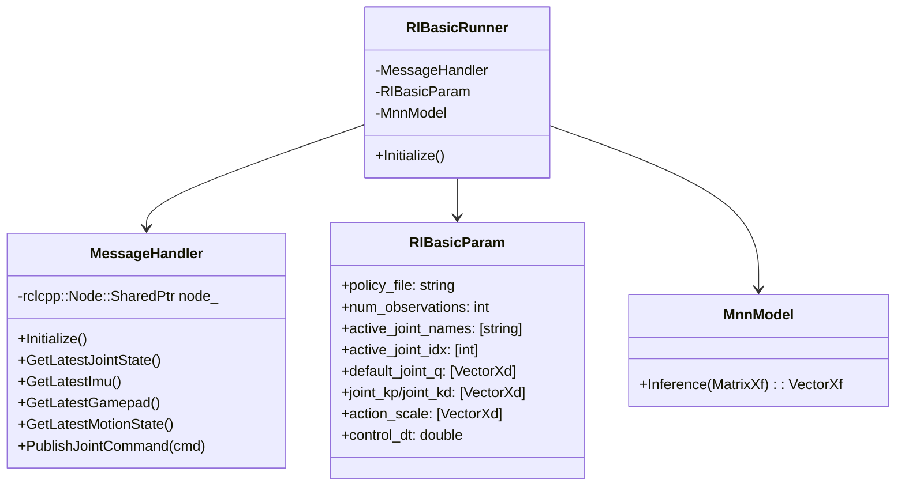

# Архитектура проекта (модель «Гепард»)

Этот документ описывает архитектуру текущего ROS 2‑workspace и конкретно отвечает на вопрос «откуда берутся объекты и сущности кода» для модели робота «Гепард» (Cheetah). Материал основан на содержимом репозитория и готов к адаптации под вашу конкретную механику/количество степеней свободы.

## Обзор слоёв
```
+-------------------------------+
| Узлы пользователя / RL‑политики|
+-------------------------------+
|  Interface Example (C++/Py)   | <-- формирование JointCommand
+-------------------------------+
|  Interface Protocol (msg/srv) | <-- типы сообщений/сервисов
+-------------------------------+
|  ROS 2 (RMW, QoS)             |
+-------------------------------+
|  Вендорские библиотеки        | (MNN, Eigen, YAML, MuJoCo, GLFW)
+-------------------------------+
|  OS / Драйверы / Аппарат      |
+-------------------------------+
```
# Архитектура проекта: модель «Гепард» (Markdown + Mermaid)

> Цель: одно место, где видно откуда берутся объекты/сущности кода для модели робота «Гепард» и как они проходят через слои проекта.

## Обзор слоёв

```mermaid
flowchart TB
  U[Пользовательские узлы / Скрипты] <--> VIZ[Визуализация/Мониторинг]
  U --> IE[Interface Example (C++/Py)]
  IE --> IP[Interface Protocol (msgs/srvs/QoS)]
  IP --> ROS[ROS 2 RMW]
  ROS --> LIBS[Библиотеки: MNN, Eigen, YAML, MuJoCo, GLFW]
  LIBS --> OS[Ubuntu + Драйверы]
  ROS <--> SIM[MuJoCo адаптер]
  SIM --> PHYS[Физика/Ресурсы URDF/MJCF]
```

Ключевые пакеты:
- `src/interface_protocol` — сообщения/сервисы, список топиков и QoS.
- `src/interface_example` — примерные узлы, RL‑цикл управления.
- `src/simulation/mujoco` — симулятор, ресурсы модели и конфиг.

## Потоки данных (темы ROS 2)



Полная таблица: `src/interface_protocol/README.md`.

## Сущности и их происхождение

- `JointState.msg`: `src/interface_protocol/msg/JointState.msg` → создаётся железом/симуляцией, читается в `MessageHandler`.
- `JointCommand.msg`: `src/interface_protocol/msg/JointCommand.msg` → создаётся в `src/interface_example/src/rl_basic_example.cc` и публикуется через `MessageHandler`.
- `ImuInfo.msg`: `src/interface_protocol/msg/ImuInfo.msg` → источник IMU (железо/сим), читается в `MessageHandler`.
- `MotionState.msg`: `src/interface_protocol/msg/MotionState.msg` → проверяется в `rl_basic_example.cc` (ожидание `joint_bridge`).
- `GamepadKeys.msg`: `src/interface_protocol/msg/GamepadKeys.msg` → команды пользователя/джойстика.
- `RlBasicParam`: `src/interface_example/src/parameter/rl_basic_param.*` → загружается из `rl_basic_param.yaml` выбранного продукта.
- `MnnModel`: `src/interface_example/src/math/mnn_model.*` → загружает `.mnn` из каталога политики, выполняет `Inference`.
- Конфиг симуляции: `src/simulation/mujoco/assets/config/*.yaml` (напр. `pm_v2.yaml`) → читается `ConfigLoader`.
- Геометрия/ресурсы модели: `src/simulation/mujoco/assets/resource/robot/<model>/*` (URDF/MJCF/xml).

## Где создаются/используются в коде

- Публикация команд: `src/interface_example/src/rl_basic_example.cc`
  - Заполняет `JointCommand.position/velocity/torque/stiffness/damping`.
  - `message_handler_->PublishJointCommand(...)` отправляет в `/hardware/joint_command`.
- Подписки и кэш последних сообщений: `src/interface_example/src/components/message_handler.hpp|.cc`
  - Sub: `/hardware/joint_state`, `/hardware/imu_info`, `/hardware/gamepad_keys`, `/motion/motion_state`.
  - Pub: `/hardware/joint_command`.
  - Методы: `GetLatestJointState`, `GetLatestImu`, `GetLatestGamepad`, `GetLatestMotionState`.
- Параметры RL: `src/interface_example/src/parameter/rl_basic_param.*`
  - Поля: `active_joint_names/idx`, `default_joint_q`, `joint_kp`, `joint_kd`, `action_scale`, размеры наблюдений/действий, шкалы, клиппинг.
- Инференс: `src/interface_example/src/math/mnn_model.*` (MNN Interpreter) → `Inference(observations)`.
- Сим‑конфиг: `src/simulation/mujoco/src/config_loader.cc` читает YAML (`urdf`, `xml`, топики, счётчики сочленений/контактов).

## Привязка к модели «Гепард»



- Каталог продукта берётся из `PRODUCT` (по умолчанию `pm01`) в `src/interface_example/launch/rl_basic_example.launch.py`.
- Для «Гепарда» создайте: `src/interface_example/config/cheetah/rl_basic/basic/`:
  - `rl_basic_param.yaml` — корректные `active_joint_names/idx`, размеры наблюдений/действий, шкалы, Kp/Kd, `policy_file`.
  - `policies/<your_policy>.mnn` — файл политики, путь указывается в `policy_file`.
- Если используете симуляцию MuJoCo:
  - Ресурсы: `src/simulation/mujoco/assets/resource/robot/cheetah/*` (URDF/MJCF/XML).
  - Конфиг: `src/simulation/mujoco/assets/config/cheetah.yaml` (по образцу `pm_v2.yaml`, поля `urdf`, `xml`, `sensor/actuator` топики, `model_param`).

## Соответствие размерностей (важно)

- Размер вектора действий модели = длине `active_joint_idx`.
- Вход сети = `num_observations * num_include_obs_steps + num_clock_signal + num_commands`.
- Размерности `joint_kp/joint_kd/action_scale` должны соответствовать количеству управляемых DOF.
- Топики должны совпадать между железом/симом и `MessageHandler` (`/hardware/joint_state`, `/hardware/joint_command`, `/hardware/imu_info`, `/motion/motion_state`).

## Пример запуска

```zsh
# Подготовить окружение
source install/setup.zsh  # либо source scripts/install/setup.zsh

# Выбрать продукт «Гепард»
export PRODUCT=cheetah

# Запуск RL‑узла
ros2 launch interface_example rl_basic_example.launch.py
```

Для симуляции запустите узел адаптера MuJoCo с вашим `cheetah.yaml` (имя исполняемого узла зависит от реализации в пакете `simulation/mujoco`).

### Проверка конфигурации (валидатор)

```zsh
# Проверка, что YAML и размеры совпадают с ожиданиями узла
python3 scripts/validate_rl_config.py src/interface_example/config/cheetah/rl_basic/basic
```

Ожидаемый вывод: подсказка по ожидаемому входу сети и сообщение `OK` либо явные ошибки/предупреждения по несоответствию размерностей.

### Где лежит шаблон для «Гепарда»

- RL‑конфиг: `src/interface_example/config/cheetah/rl_basic/basic/rl_basic_param.yaml`
- Политика (положите сюда свой `.mnn`): `src/interface_example/config/cheetah/rl_basic/basic/policies/`
- Сим‑конфиг: `src/simulation/mujoco/assets/config/cheetah.yaml`
- Ресурсы модели: `src/simulation/mujoco/assets/resource/robot/cheetah/{urdf,xml}`

## Диагностика

- Быстрая проверка связности офлайн‑пакетов: `scripts/offline_verify.sh` (проверяет связность `rl_basic_example`).
- Визуализация: макет `src/interface_protocol/scripts/pm_data_layout.xml` (кривые по IMU и суставам).

## Где редактировать

- Сообщения/топики: `src/interface_protocol/msg/*.msg`, `src/interface_protocol/README.md`.
- Лаунч/окружение: `src/interface_example/launch/rl_basic_example.launch.py` (`PRODUCT`).
- Логика RL‑узла: `src/interface_example/src/rl_basic_example.cc`.
- Параметры RL: `src/interface_example/src/parameter/rl_basic_param.*` + ваш YAML в `config/cheetah/...`.
- Политика: `src/interface_example/src/math/mnn_model.*` + `.mnn` в `policies/`.
- Сим‑ресурсы/конфиг: `src/simulation/mujoco/assets/resource/robot/cheetah/*`, `src/simulation/mujoco/assets/config/cheetah.yaml`.

—
Документ отражает текущую структуру workspace и источники сущностей для модели «Гепард». По запросу можно сгенерировать шаблоны `config/cheetah` и `cheetah.yaml`.

## Приложение A: Трассируемость сущностей → файлы

- Узел RL: `src/interface_example/src/rl_basic_example.cc` → создаёт/публикует `JointCommand`.
- Подписки/паблишер: `src/interface_example/src/components/message_handler.hpp|.cc` → инициализация QoS и топиков.
- Параметры RL: `src/interface_example/src/parameter/rl_basic_param.*` → загрузка YAML, приведение типов/векторов.
- Политика MNN: `src/interface_example/src/math/mnn_model.*` → загрузка и инференс.
- Сообщения/сервисы: `src/interface_protocol/msg/*.msg`, `src/interface_protocol/srv/*.srv`.
- Симуляция: `src/simulation/mujoco/src/config_loader.cc`, `src/simulation/mujoco/assets/*`.

## Приложение B: QoS и частоты (сводно)

- В `MessageHandler` используется `QoS(3)`, `best_effort()`, `durability_volatile()` для высокочастотных сенсорных потоков.
- Рекомендация: не поднимать QoS до reliable для потоков >500 Гц без крайней необходимости.

## Приложение C: Контекст FSM / режимы

- Узел ждёт `MotionState.current_motion_task == "joint_bridge"` перед началом управления.
- Источник: топик `/motion/motion_state`.

## Приложение D: Чек‑лист валидации RL‑конфига

- Совпадает ли длина `active_joint_idx` с размером действия модели (выход MNN)?
- `num_observations * num_include_obs_steps + num_clock_signal + num_commands` равно входу модели?
- Имеют ли `default_joint_q / joint_kp / joint_kd / action_scale` корректные группы и суммарные длины?
- `control_dt` согласован с целевым циклом и стабильностью?
- Масштабы/клиппинг (`observation_scale`, `observation_clip`, `action_clip`) не обрезают полезный сигнал?

## Приложение E: Классы (Mermaid)


